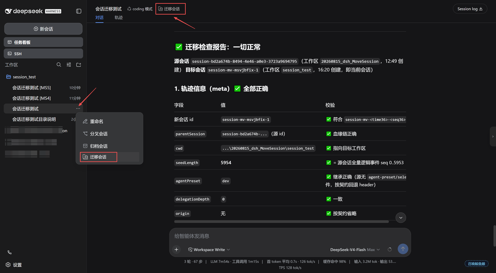

# dsh-move-session

[English](README.en.md) | 中文

跨工作区会话迁移插件（dsh Web GUI）。在会话操作区新增 **Move Session（迁移会话）** 入口：
将当前会话**原封不动**地复制到另一个工作区（完整保留对话日志、标题、Agent 预设、模型选择），
并支持**保留原会话**或**归档原会话**。仅支持**空闲会话**迁移。

> 当前版本 **v0.1.3**。与 `dsh-ssh` / `dsh-task-board` 等插件同一套"热插拔"约定：
> `cordis.patch.yml` 挂载 + profile node_modules 安装，**不改任何 dsh 源码**。
> 本包为零依赖纯 JavaScript，**源码即产物**（`lib/` 即运行时文件），无需构建。

---

## 功能

| 需求 | 实现 |
| --- | --- |
| 1. 会话操作中新增「迁移会话」 | ① 会话头部操作行 **Move Session** 按钮（图标+文字，与 agent 预设、子代理目录、任务列表并列）；② 侧边栏会话行「…」菜单**注入**「迁移会话」项（紧随重命名/分叉/归档之后，正式安装版支持） |
| 2. 原封不动迁到新工作区，保留全部上下文 | 复制完整事件日志（消息、工具调用、标题、agent-preset/selected、request/header 等全部事件原样保留），目标工作区新建会话记录 |
| 3. 保留原会话 或 归档原会话 | 对话框内单选：`保留原会话`（默认）或 `归档原会话`（真迁移） |
| 4. 合适的 UI 交互 | 图标+文字按钮 → 模态对话框（目标工作区单选 + 模式单选 + 错误/成功态），迁移后自动跳转/提供打开入口；全部文案跟随 dsh 语言设置（中/英） |

其它细节：

- **仅空闲会话可迁移**：会话运行中（agent `running`）时按钮置灰，宿主端再次校验并拒绝。
- **跨端自动刷新**：复制会话经 `agents.create` 发布为 live（与官方分叉同一路径），触发
  `host/session-added` 帧；`attachSession` 触发 `host/workspace-changed` 帧；归档触发
  `host/archived-sessions-changed` 帧——所有打开标签页的侧边栏即时更新，无需刷新页面。
- **模型与预设继承**：副本以源会话日志中最后一次 `request/header` 的 provider/model 作为
  agentOptions（优于官方分叉的"当前默认模型"），并以源会话的 agent 预设（`agentPreset`
  或最后一条 `agent-preset/selected` 事件）组合其 agent 世界。
- **血缘保留**：副本 header 记录 `parentSession` = 源会话 id、`seedLength` = 全部事件数，
  与官方分叉的 lineage 语义一致；时间戳、事件顺序逐字节保留。
- **多会话安全**：副本使用新会话 id（`session-mv-<time36>-<seq36>`），不覆盖、不删除任何
  现有记录；"保留原会话"模式中源会话完全不动。
- **同名区分**：仅当目标工作区已存在同名会话时，副本标题追加 **`[MS<n>]`** 标记
  （如 `我的会话 [MS1]`），`n` 取目标区已有 `[MS<n>]` 的最大值 + 1——重复迁移自动递增不冲突，
  已带标记的副本再次迁移时**替换**而非累积；无同名则保持原标题，无标题会话不加。
  与官方分叉的数字后缀 ` (1)` / `（1）` 明显不同。
- **空工作区支持**：迁移不依赖目标工作区是否有会话，新工作区可直接作为迁移目标（目录需存在）。



---

## 安装

### 方式一：npm 发布后（推荐）

```bash
dsh plugin --profile web add @hucj/dsh-move-session
```

### 方式二：本地路径（开发调试）

```bash
git clone git@github.com:hucj09/dsh-move-session.git   # 或使用已有源码目录
cd dsh-move-session
npm run check     # 语法检查 + 全部单元/结构测试（本包零构建，lib/ 即产物）
```

然后安装：

```bash
dsh plugin --profile web add link:/path/to/dsh-move-session
```

`link:` 安装为**符号链接**：源码改动后重新运行 `npm run check` 即可，重启 dsh 生效。
（也可用 `file:` 安装为一次性拷贝，源码后续改动不会自动同步。）

安装后**重启 dsh web**（新 bundle 只在下次启动时加载），浏览器 **Ctrl+F5** 强刷，
打开任意会话后头部操作行出现「迁移会话」按钮即安装成功。

> 注：`dsh.client.inject` 为空、插件自身 `inject: ['slots', 'sessions', 'locale']` 声明硬依赖，
> 宿主需已组装 `@deepseek-ai/dsh-client-runtime` 等标准 web 运行时（默认部署包含）。

## 卸载

```bash
dsh plugin --profile web remove @hucj/dsh-move-session
```

该命令自动完成三件事：
1. 从 `dependencies` 删除依赖
2. 从 `dsh.profile.bundles` 删除 bundle 行
3. 删除 `node_modules/@hucj/dsh-move-session` 安装目录

之后**重启 dsh web** 生效。

---

## 使用

1. 打开一个**空闲**会话。
2. 点击会话头部操作行的 **Move Session** 按钮（侧边栏会话行「…」菜单中也有「迁移会话」项）。
3. 选择目标工作区（列表排除当前工作区，显示路径与会话数）。
4. 选择原会话处理方式：
   - **保留原会话**（默认）：源会话原样保留，目标工作区生成完整副本，提供「打开迁移后的会话」；
   - **归档原会话**：源会话进入归档集合（从所有分组表面隐藏，日志与记账保留），
     视图自动跳转到迁移后的会话。
5. 确认后侧边栏即时更新；副本的全部消息、工具调用、模型与预设与源会话一致；标题默认相同，
   目标工作区已存在同名会话时自动追加 `[MS<n>]` 区分（如 `我的会话 [MS1]`）。

---

## 工作原理（简要）

- **宿主端**（`lib/index.js`）：注册 loopback-only HTTP 路由 `POST /api/dsh-move-session/move`，
  处理流程与官方 `session.fork` 处理器逐段对应：空闲校验 → flush 后读取全量日志 →
  目标/同区校验 → **目标目录预检**（`fs` 服务，目录失效在任何写入前拒绝）→ 铸造新身份
  （新 id + 目标 cwd + 血缘）→ `agents.create` 发布副本（seed = 全量事件，setup 经
  `agentPresets.resolve/mount` 组合源预设）→ **同名标题后缀**（`sessionQuery` 读目标区标题，
  同名时 `sessionTitle.rename` 追加 `[MS<n>]`）→ `attachSession` 记账 → 按模式
  `archiveSession` 归档源会话。
- **浏览器端**（`lib/client.js`）：标准 web 插件包，注册进 `conversation.session.header.actions`
  按钮插槽与 `shell.overlay` 对话框插槽（均为官方可加插槽，`replaceRisk: none`）；
  侧边栏行菜单项通过 ARIA role 锚点注入（官方菜单是 portal 渲染的 `[role="menu"]`，
  会话 id 从行元素 React fiber 恢复），不依赖官方 CSS 类名。
- **日志完整性**：迁移 = 全量日志逐事件复制，可用 `npm run test:integrity` 对任意
  源/副本做逐事件一致性校验（真实数据验证：1042 个事件 + 212 条 chunk 记录 100% 保留）。

---

## 开发与测试

```bash
npm run check         # 语法检查 + 全部单元/结构测试（node --test，提交前必须全绿）
npm run test:watch    # 开发模式：文件变更自动重跑全部测试
npm run test:ui       # Playwright 交互测试（对话框 + 行菜单注入 + 主题跟随，需本机浏览器）
npm run test:integrity # 真实迁移日志逐事件一致性校验（Python）
```

**自动化门禁**：`.githooks/pre-commit` 会在每次 `git commit` 前自动执行 `npm run check`
（失败阻止提交）；`.github/workflows/ci.yml` 在 push/PR 到 GitHub 后自动执行 `npm run check`。

维护者与 AI 助手的协作规则见 **AGENTS.md**（版本、测试、提交、代码不变量）；
版本历史见 **docs/CHANGELOG.md**。

---

## 错误码

| code | 含义 |
| --- | --- |
| `invalid-session` / `invalid-target` / `invalid-mode` | 请求参数缺失或非法 |
| `unavailable` | 所需宿主服务未挂载（agents / sessionPersistence / workspaceRegistry） |
| `session-busy` | 会话正在运行，仅空闲会话可迁移 |
| `session-not-found` | 会话不存在于 session persistence |
| `target-not-found` | 目标工作区不存在 |
| `same-workspace` | 会话已属于目标工作区 |
| `target-missing-dir` | 目标工作区目录不存在或已失效（如临时目录被清理）；**在任何写入前拒绝，不产生孤儿副本** |
| `preset-unavailable` | 源会话的 agent 预设无法解析（组合被拒，迁移不产生任何写入） |
| `copy-failed` | 副本创建失败（含日志不平衡等 seed 校验失败） |
| `attach-failed` | 副本已创建但工作区记账失败（与官方分叉的 attach 失败语义一致） |
| `internal` | 未预期异常 |

---

## 限制与边界

- 仅**空闲**会话可迁移；运行中会被客户端禁用 + 宿主端拒绝。
- 迁移要求源日志**平衡**（无未闭合的 turn/step 或悬挂工具调用）——空闲会话天然满足；
  若日志在异常中断后未修复，副本创建会被 dsh 的 seed 校验拒绝（与官方分叉相同的严格性）。
- 会话 id 会变化（`session-mv-*`）：这是**复制**语义的必然——dsh 以 id 为持久化主键，
  同 id 双工作区会破坏列表/账目。血缘通过 `parentSession` 保留。
- 副本会以 live（空闲）agent 形式驻留内存（与官方分叉的子会话一致），不随本插件卸载。
- 迁移只复制**会话日志**；附件/文件本身不受影响（附件按需读取，日志中的引用原样保留）。
- 「归档原会话」为 registry 级全局归档集合（与侧边栏归档操作同一机制），归档后可恢复的位置
  保留，但本插件不提供取消归档入口（与官方一致）。

---

## License

MIT
